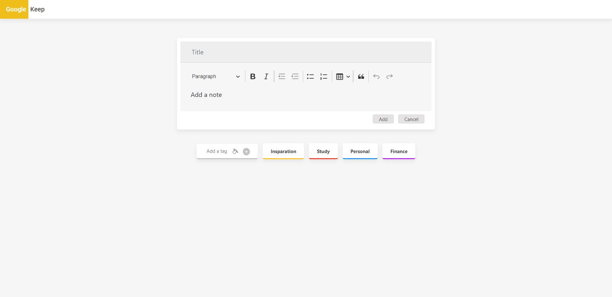
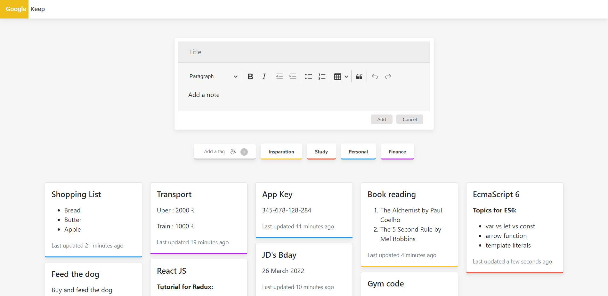

<b>Highlighted Features used in this project:</b>

- Hooks used : useState
- Material UI
- Google Fonts
- Bootstrap
- React Color(dependency): A Collection of Color Pickers from Sketch, Photoshop, Chrome, Github, Twitter, Material Design & more
- Tag for different category
- @ckeditor/ckeditor5(dependency): For rich text box
- html-react-parser(dependency): To convert rich text into html format
- Moment(dependency): DateTime Librery used for finding note time.
                    : fromnow() - This is sometimes called timeago or relative time.

